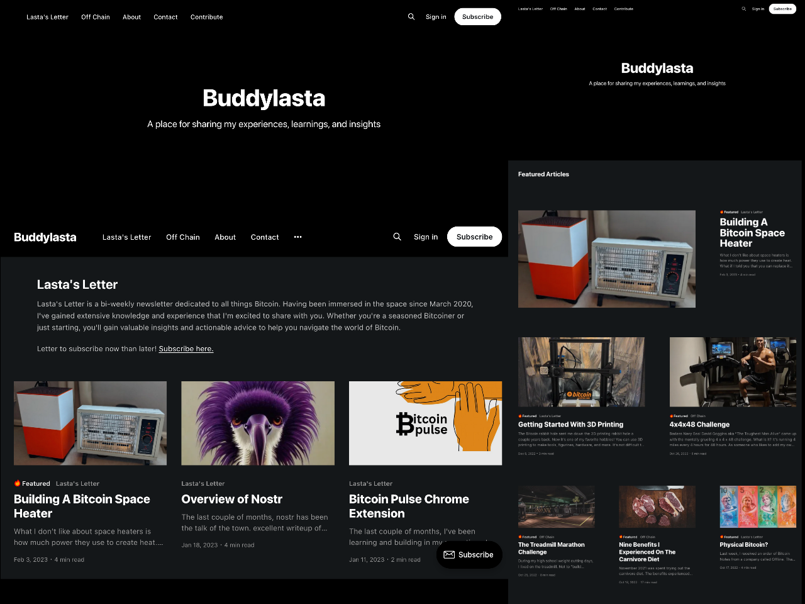

# Lowkey

I downloaded [Ghost's]((http://github.com/tryghost/ghost/)) default theme [Casper](https://github.com/TryGhost/Casper/), used what I learned from [Christopher Dodd's skillshare course](https://www.skillshare.com/en/classes/Ghost-Theme-Development-How-to-Customise-Your-Ghost-Publication/1570520217/) to edit it, and published it at https://www.buddylasta.com. It's now my main website for all of my content!

I call the custom theme Lowkey – a simple ghost theme with an emphasis on solo creators.

# Recommendations

I highly recommend going through [Christopher Dodd's skillshare course](https://www.skillshare.com/en/classes/Ghost-Theme-Development-How-to-Customise-Your-Ghost-Publication/1570520217/) before customizing a Ghost theme for the first time. It's less than 3 hours and simplified the process greatly. Use my [Skillshare referral link](https://skl.sh/3yoDpE2) to get 1 month free.


&nbsp;



&nbsp;

# First time using a Ghost theme?

Ghost uses a simple templating language called [Handlebars](http://handlebarsjs.com/) for its themes.

This theme has lots of code comments to help explain what's going on just by reading the code. Once you feel comfortable with how everything works, we also have full [theme API documentation](https://ghost.org/docs/themes/) which explains every possible Handlebars helper and template.

**The main files are:**

- `default.hbs` - The parent template file, which includes your global header/footer
- `index.hbs` - The main template to generate a list of posts, usually the home page
- `post.hbs` - The template used to render individual posts
- `page.hbs` - Used for individual pages
- `tag.hbs` - Used for tag archives, eg. "all posts tagged with `news`"
- `author.hbs` - Used for author archives, eg. "all posts written by Jamie"

One neat trick is that you can also create custom one-off templates by adding the slug of a page to a template file. For example:

- `home.hbs` - Custom template to generate a list of posts for the home page. Replaces index.hbs content
- `page-about.hbs` - Custom template for an `/about/` page
- `page-lastas-letter.hbs` - Custom template for [newsletter #1](https://www.buddylasta.com/lastas-letter) page
- `page-off-chain.hbs` - Custom template for [newsletter #2](https://www.buddylasta.com/off-chain) page
- `tag-news.hbs` - Custom template for `/tag/news/` archive
- `author-ali.hbs` - Custom template for `/author/ali/` archive


# Development

Lowkey styles are compiled using Gulp/PostCSS to polyfill future CSS spec. You'll need [Node](https://nodejs.org/), [Yarn](https://yarnpkg.com/) and [Gulp](https://gulpjs.com) installed globally. After that, from the theme's root directory:

```bash
# install dependencies
yarn install

# run development server
yarn dev
```

Now you can edit `/assets/css/` files, which will be compiled to `/assets/built/` automatically.

The `zip` Gulp task packages the theme files into `dist/<theme-name>.zip`, which you can then upload to your site.

```bash
# create .zip file
yarn zip
```

# PostCSS Features Used

- Autoprefixer - Don't worry about writing browser prefixes of any kind, it's all done automatically with support for the latest 2 major versions of every browser.
- [Color Mod](https://github.com/jonathantneal/postcss-color-mod-function)


# SVG Icons

Casper uses inline SVG icons, included via Handlebars partials. You can find all icons inside `/partials/icons`. To use an icon just include the name of the relevant file, eg. To include the SVG icon in `/partials/icons/rss.hbs` - use `{{> "icons/rss"}}`.

You can add your own SVG icons in the same manner.


# Copyright & License
- Feel free to use Lowkey as you please!
- Copyright (c) 2013-2022 Ghost Foundation - Released under the [MIT license](LICENSE).

# To Do
- Make key areas of this theme customizable
